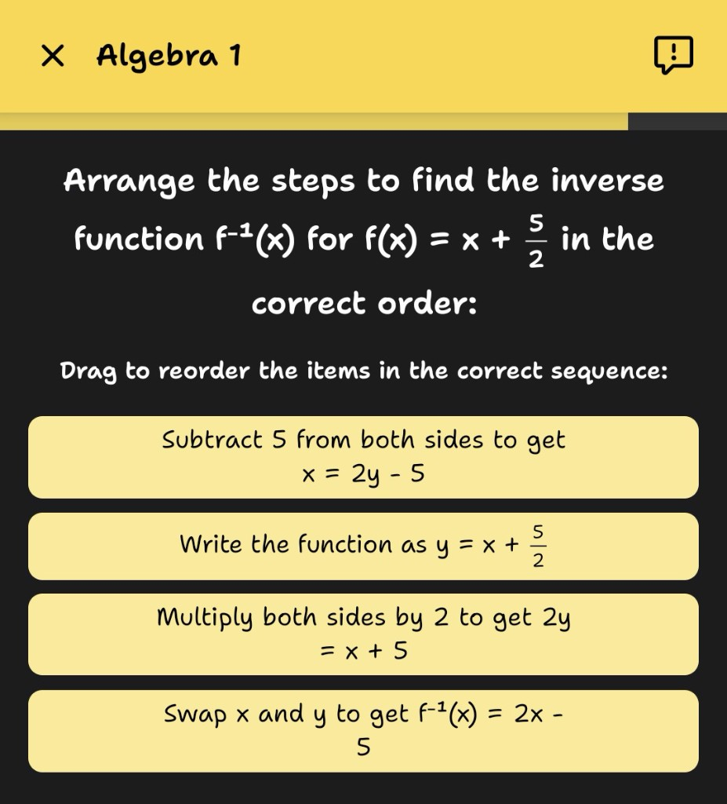

# react-native-fractions

For React Native apps that show school-level maths, this library draws **stacked fractions** inline: a numerator, a horizontal rule, and a denominator, using the same font and colour as the surrounding sentence. They wrap and sit on the baseline like ordinary text—not a separate overlay or a hand-rolled SVG layout on top of `Text`.

## What it looks like

Below are real in-app screenshots (Science Shorts). Drag-and-drop tiles, headers, and answer buttons are your own UI; **react-native-fractions** only supplies the small stacked fraction inside the question copy.

<table>
  <tr>
    <td width="50%" align="center" valign="top">
      
      <p><em>Inverse-function style prompt: the fraction sits in the sentence with the same typography as the words around it.</em></p>
    </td>
    <td width="50%" align="center" valign="top">
      
      <p><em>Formula line showing <strong>−b</strong> over <strong>2a</strong> as an inline stacked fraction next to the rest of the text.</em></p>
    </td>
  </tr>
</table>

## Why this library

- **Inline with real text.** The fraction participates in line-breaking and baseline alignment, so it won't clip, overlap the next line, or float out of place on small screens.
- **Uses your font.** Pass `fontFamily` / `fontWeight` and the fraction is rendered with the same typeface as the surrounding text.
- **Zero layout math.** You don't need to wrap everything in `<View>` / `flexDirection`. Just drop it in where you'd use `<Text>`.
- **Nested fractions, superscripts and subscripts.** Numerators and denominators can themselves contain fractions or raised/lowered scripts, so GCSE-style expressions like `25^(-3/2)` or `1 / 25^(-3/2)` render as true stacked glyphs with a shrunk stacked exponent — no MathJax, no WebView.

## Requirements

- React Native **0.73+**
- React **18+**
- iOS **13.4+**
- Android **API 24+**

## Installation

```bash
npm install react-native-fractions
# or
yarn add react-native-fractions
```

### iOS

```bash
cd ios && pod install
```

Autolinking handles the rest — no `AppDelegate` edits.

### Android

Autolinking registers the package. No `MainApplication` changes on modern React Native.

Rebuild the native app once after installing (`npx react-native run-ios` / `run-android`). Metro reload alone isn't enough because native code changed.

## Quick start

Prefer pictures first? See [What it looks like](#what-it-looks-like).

You only use `FractionText` for the specific text that contains a fraction. **The rest of your app stays as regular `<Text>`** — there's nothing global to opt into and no app-wide tokenizer to set up.

```tsx
import { FractionText } from 'react-native-fractions';

export function AnswerHint() {
  return (
    <FractionText
      fontSize={16}
      lineHeight={22}
      color="#111"
      runs={[
        { type: 'text', text: 'The answer is ' },
        { type: 'fraction', numerator: '3', denominator: '4' },
        { type: 'text', text: ' metres.' },
      ]}
    />
  );
}
```

### What's a "run"?

A **run** is just a small object that tells the component what a chunk of the string should look like: either plain text or a stacked fraction. Runs are rendered in order, back-to-back, on the same line(s).

```ts
{ type: 'text', text: 'x = ' }
{ type: 'fraction', numerator: '1', denominator: '2' }
```

That's the whole data model.

## Examples

### 1. Simple inline fraction

```tsx
<FractionText
  fontSize={18}
  lineHeight={24}
  color="#222"
  runs={[
    { type: 'text', text: 'Half a kilo = ' },
    { type: 'fraction', numerator: '1', denominator: '2' },
    { type: 'text', text: ' kg' },
  ]}
/>
```

### 2. Algebraic fraction with a variable

```tsx
<FractionText
  fontSize={20}
  lineHeight={28}
  color="#000"
  runs={[
    { type: 'fraction', numerator: 'x', denominator: '7' },
    { type: 'text', text: ' + 2' },
  ]}
/>
```

### 3. Negative / multi-character numerator

Numerator and denominator are just strings, so signs and multi-character expressions work:

```tsx
<FractionText
  fontSize={20}
  lineHeight={28}
  color="#000"
  runs={[
    { type: 'text', text: 'x = ' },
    { type: 'fraction', numerator: '-b', denominator: '2a' },
  ]}
/>
```

### 4. Wider fractions

The bar auto-expands to the wider of the two cells:

```tsx
<FractionText
  fontSize={16}
  lineHeight={22}
  color="#333"
  runs={[
    { type: 'text', text: 'Ratio: ' },
    { type: 'fraction', numerator: '56', denominator: '100' },
  ]}
/>
```

### 5. Custom font + weight

```tsx
<FractionText
  fontSize={18}
  lineHeight={24}
  color="#111"
  fontFamily="Inter-SemiBold"
  fontWeight="600"
  runs={[
    { type: 'text', text: 'y = ' },
    { type: 'fraction', numerator: '24', denominator: '6' },
    { type: 'text', text: ' = 4' },
  ]}
/>
```

### 6. Centered answer card

```tsx
<FractionText
  fontSize={24}
  lineHeight={32}
  color="#0A84FF"
  textAlign="center"
  runs={[
    { type: 'fraction', numerator: '3', denominator: '8' },
  ]}
/>
```

### 7. Thicker rule

Bump the vinculum stroke with `barThickness` (see [Styling the bar](#styling-the-bar)):

```tsx
<FractionText
  fontSize={22}
  lineHeight={30}
  color="#111"
  barThickness={2.5}
  runs={[
    { type: 'fraction', numerator: '7', denominator: '12' },
  ]}
/>
```

### 8. Stacked exponent (`25^(-3/2)`)

Since **0.3.0**, a `superscript` run can wrap any other runs — including a fraction — so `25` to the power of `-3/2` renders as the base with a shrunk stacked exponent sitting at superscript height:

```tsx
<FractionText
  fontSize={22}
  lineHeight={30}
  color="#111"
  runs={[
    { type: 'text', text: '25' },
    {
      type: 'superscript',
      content: [
        { type: 'fraction', numerator: '-3', denominator: '2' },
      ],
    },
  ]}
/>
```

### 9. Fraction whose denominator carries a stacked exponent (`1 / 25^(-3/2)`)

For expressions where the exponent grammatically binds to the denominator, use the optional `denominatorRuns` array (also new in **0.3.0**). Plain `numerator` / `denominator` strings are still populated as a fallback for older library versions; 0.3.0+ uses the structured arrays when present.

```tsx
<FractionText
  fontSize={22}
  lineHeight={30}
  color="#111"
  runs={[
    {
      type: 'fraction',
      numerator: '1',
      denominator: '25',
      numeratorRuns: [{ type: 'text', text: '1' }],
      denominatorRuns: [
        { type: 'text', text: '25' },
        {
          type: 'superscript',
          content: [
            { type: 'fraction', numerator: '-3', denominator: '2' },
          ],
        },
      ],
    },
  ]}
/>
```

### 10. Subscripts

`subscript` is the lowered-baseline mirror of `superscript`. Handy for chemistry labels inside equations:

```tsx
<FractionText
  fontSize={18}
  lineHeight={24}
  color="#111"
  runs={[
    { type: 'text', text: 'x' },
    { type: 'subscript', content: [{ type: 'text', text: '1' }] },
    { type: 'text', text: ' + x' },
    { type: 'subscript', content: [{ type: 'text', text: '2' }] },
  ]}
/>
```

### 11. Turning a string like `"y = 24/6"` into runs (optional helper)

If you'd rather write plain strings in your content and let code split out the fractions, drop this 10-line helper somewhere in your app. You don't have to use it — write your own parser if you prefer, or just build `runs` by hand.

```ts
import type { TokenRun } from 'react-native-fractions';

const FRACTION_RE = /(-?[A-Za-z0-9]+)\/([A-Za-z0-9]+)/g;

export function stringToRuns(input: string): TokenRun[] {
  const out: TokenRun[] = [];
  let lastIndex = 0;
  for (const match of input.matchAll(FRACTION_RE)) {
    const [full, numerator, denominator] = match;
    const start = match.index ?? 0;
    if (start > lastIndex) {
      out.push({ type: 'text', text: input.slice(lastIndex, start) });
    }
    out.push({ type: 'fraction', numerator, denominator });
    lastIndex = start + full.length;
  }
  if (lastIndex < input.length) {
    out.push({ type: 'text', text: input.slice(lastIndex) });
  }
  return out;
}
```

Then:

```tsx
<FractionText
  fontSize={16}
  lineHeight={22}
  color="#111"
  runs={stringToRuns('Solve for x: -b/2a, then y = 24/6')}
/>
```

## Styling the bar

The horizontal rule is drawn at roughly **6% of the fraction font size** by default, which matches most body-text weights. If you'd like a heavier rule (e.g. for a headline answer card, or to match a specific typeface), pass `barThickness` in dp/pt:

```tsx
<FractionText barThickness={2} ... />   // chunky
<FractionText barThickness={0.5} ... /> // hairline
```

Omit `barThickness` to keep the default, proportional behaviour.

## API

### `<FractionText />`

| Prop | Type | Required | Description |
|------|------|:-:|-------------|
| `runs` | `TokenRun[]` | yes | Ordered text and fraction segments. |
| `fontSize` | `number` | yes | Font size in dp/pt (same sense as RN `Text`). |
| `lineHeight` | `number` | yes | Minimum line height for layout. |
| `color` | `string` | yes | e.g. `"#000"`, `"rgba(...)"`. |
| `fontFamily` | `string` | – | A registered font family (custom or system). |
| `fontWeight` | `string` | – | `"400"`, `"600"`, `"700"`, `"bold"`, … |
| `textAlign` | `'left' \| 'center' \| 'right'` | – | Horizontal alignment. |
| `barThickness` | `number` | – | Rule stroke thickness in dp/pt. Defaults to ~6% of the fraction font size. |
| `style` | `ViewStyle` | – | Outer wrapper style. |

### Run types

```ts
type TextRun = { type: 'text'; text: string }

type FractionRun = {
  type: 'fraction'
  // Plain-string numerator / denominator — always populated,
  // even when structured runs are provided, so older library
  // versions render a legible fallback.
  numerator: string
  denominator: string
  // Added in 0.3.0. When present, these override the string
  // fields and may themselves contain fractions or scripts.
  numeratorRuns?: TokenRun[]
  denominatorRuns?: TokenRun[]
}

// Added in 0.3.0.
type SuperscriptRun = { type: 'superscript'; content: TokenRun[] }
type SubscriptRun   = { type: 'subscript';   content: TokenRun[] }

type TokenRun = TextRun | FractionRun | SuperscriptRun | SubscriptRun
```

Everything added in 0.3.0 is **purely additive**: existing apps that emit only `TextRun` and string-based `FractionRun`s continue to render identically, no code changes required.

Scripts are drawn at **65%** of the parent font size with the baseline raised (super) or lowered (sub) by ~`capHeight * 0.45`. Nested fractions inside a numerator, denominator or script scale to **75%** of the parent font size, so fractions-inside-fractions and stacked exponents stay visually balanced without manual font tuning.

### Fallback when native isn't linked

If the native view isn't registered (usually: you installed the library but haven't rebuilt the app yet), `FractionText` renders a plain `<Text>` that flattens each run and logs a single development-only warning:

- `FractionRun` → `numerator/denominator` (walks `numeratorRuns` / `denominatorRuns` recursively when provided)
- `SuperscriptRun` → `^(…)`
- `SubscriptRun` → `_(…)`

This keeps the screen usable while making the missing rebuild obvious in `__DEV__`. Release builds never warn.

## How it works

- **iOS:** builds an `NSAttributedString` containing an `NSTextAttachment` per fraction / script, drawn into a `UIImage` aligned to the host font's x-height. A recursive `FractionRenderer` composes nested runs (fraction-in-fraction, fraction-in-superscript) onto the same canvas before attaching, so everything remains a single inline glyph.
- **Android:** builds a `SpannableStringBuilder` and draws each fraction or script via a custom `ReplacementSpan`. Measurement reports extra ascent/descent so line height accounts for two-row glyphs, and a shared `FractionRenderer` on `Canvas` handles the nested run tree.

Both platforms read the host font's metrics (ascent, descent, x-height) so the fraction sits on the text baseline with the bar roughly through the middle of the x-height, regardless of which font you pass in.

## Changelog

### 0.3.0

- **New run types:** `SuperscriptRun` and `SubscriptRun`. `content` may contain any other runs, including a `FractionRun` — enough to render a shrunk stacked exponent (`25^(-3/2)`) as a single inline glyph.
- **Nested fractions:** `FractionRun` gained optional `numeratorRuns` / `denominatorRuns`. When present they override the string fields, so one side of a fraction can itself contain fractions or scripts. String `numerator` / `denominator` are still required and populated as a 0.2.x fallback.
- Shared `FractionRenderer` on both platforms so every new shape uses the same measurement and layout code.
- 100% backwards compatible: apps on 0.2.x upgrade without any code changes.

### 0.2.0

- Initial public release: inline stacked fractions on iOS and Android, `barThickness` prop, font + weight pass-through.

## License

MIT — see [LICENSE](./LICENSE). Copyright © 2026 Made Responsively Ltd.
